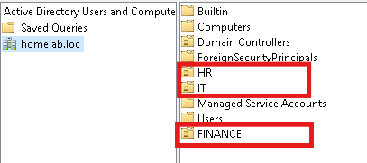
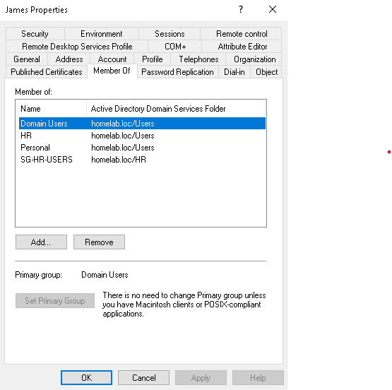

# 02 — Active Directory

## What's in the Domain

**Domain:** `homelab.loc`

**Organizational Units:** The OU for this project is structured based on real-life scenarios and departments, including HR and IT, rather than a flat list of users. 
** Security Groups:** Created per department

**Users:** After creation of the OU, users were created and assigned to their respective OU and group. This includes user "James", a part of the HR OU, and this user is used throughout the project to mimic various real-life troubleshooting scenarios.

**Password Policy:** Updated at the domain level.

---

## Reason for the Design

- **Departmental OUs, not a flat structure** — As this project intends to mimic real-life scenarios, everything scoped later in the project applies at an OU level rather than having a flat structure and pick and choose users to give certain policies or permissions. 
- **Security groups over individual accounts** — Permissions and policy scoping were designed to reference groups, not people directly, so adding or removing someone from a role is a group membership change, not a re-configuration of every permission/policy that referenced them individually.
- **A consistent naming convention** — Makes groups and OUs predictable to navigate as the structure grows, rather than relying on memory for what each one contains.

---

## Key Lessons Learned

- **Structure decided early shapes everything later** — OU design isn't just organizational tidiness; it directly determines what can be cleanly targeted with Group Policy and delegation down the line.
- **Local admin rights and AD-level rights are not the same thing** — attempting to manage AD while only locally elevated on a client machine (rather than using an actual domain-level account) surfaced this distinction directly rather than as an abstract concept.
