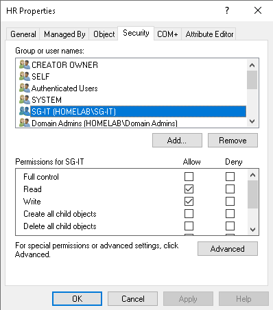
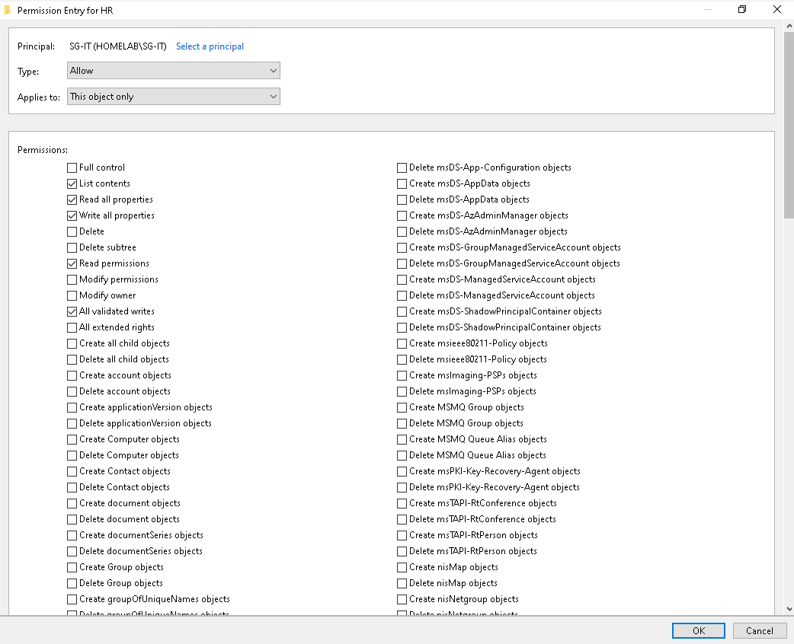
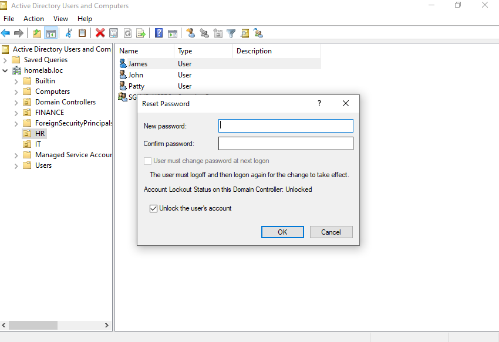

# 03 — Least-Privilege Delegation

## What Was Built

For this project, a dedicated `Helpdesk` account was created and given a limited set of AD rights through Delegation on Control Wizard instead of it being directly to Domain Admins.

**Delegated to:** The `SG-IT` security group, with the Helpdesk account as a member.
**Scope:** the IT and HR OUs.
**Rights granted:**
- Create, delete, and manage user accounts
- Reset user passwords and force a password change at next logon
- Generate Resultant Set of Policy (Planning)

**Not granted:** Domain Admin membership, and any rights over groups, computers, Group Policy objects, or the OU structure itself.

The account is used from a Windows 10 client through RSAT, rather than by logging into the domain controller.

---

## Design Reasoning

- **Delegation instead of Domain Admin** — For day-to-day management full control over the entire domain is not necessary and a security vulnerability and hence, delegating specific tasks helps to avoid misuse or compromise. 
- **Delegated to a group, not the account** — The specific rights have been granted to the group `SG-IT` rather than individual users to prevent repeating the use of wizard and to make sure all users within a group have the same rights rather than enforcing it on an individual level.
- **Scoped to OUs, not the domain** — The rights apply only in the departments where the account has a reason to act.

---

## Boundary Testing

After setting up the rights, it was tested out to see if it worked. So after logging into the helpdesk account from one of the Desktops, the following were attempted.

| Action attempted | Result | Why |
|---|---|---|
| Reset a password for a user (James) in HR | ✅ Able to do | Password reset was delegated on the HR OU |
| Create a new user | ✅ Able to do | Create/delete user accounts was delegated on IT and HR |
| Create a new OU | ❌ Unable to do | Delegation covers user objects only, not OU structure |
| Add a user to a privileged group | ❌ Unable to do | Group membership changes weren't delegated |
| Reset the built-in Administrator's password | ❌ Unable to do | Outside the delegated OUs, and privileged accounts are additionally protected |

---

## Key Lessons Learned

- **Local admin and domain-level rights are separate** — Being an administrator on a client machine gave no ability to change anything in AD. That takes a domain account holding AD permissions.
- **Delegation only covers what it names** — These rights apply to AD objects. Access to other things, such as Remote Desktop, the remote registry, file shares, and printers, is controlled by separate mechanisms and needed its own grants (see folders 05–07).
- **"Manage user accounts" is broader than it sounds** — It includes create and delete, not just password resets. Splitting that into tiers is the natural next refinement.
- **Group-based rights apply at the next logon** — after delegating to a group and adding the account to it, the rights didn't appear until the helpdesk account logged off and back on, because group membership is read into the logon token when it's issued.
