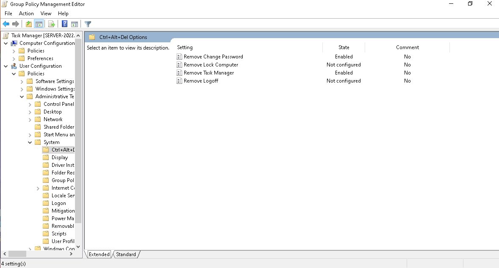
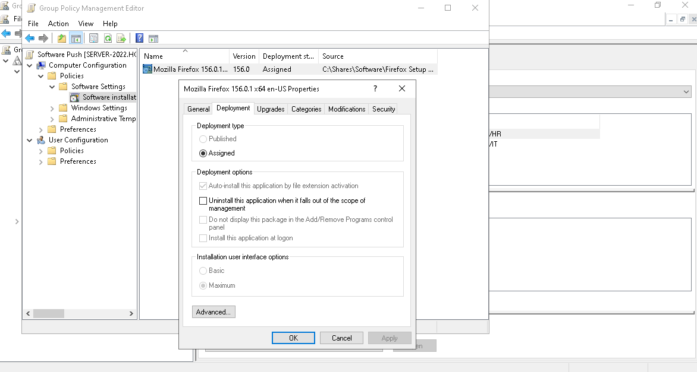
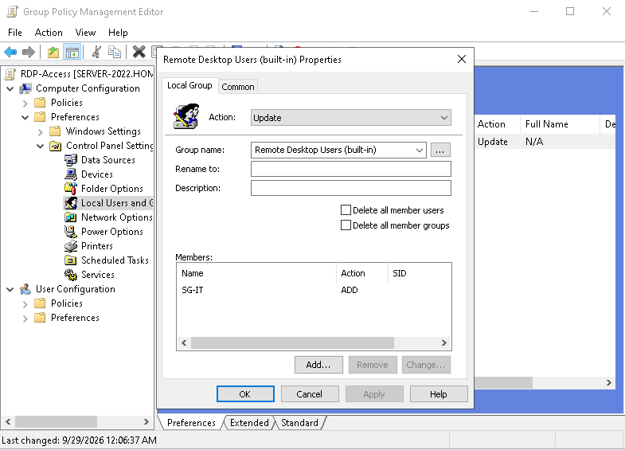
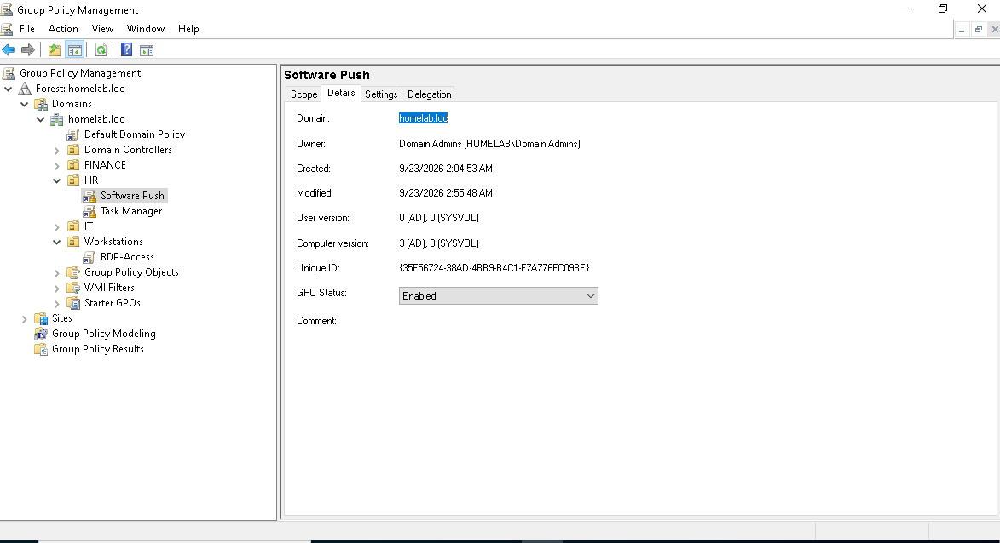

# 04 — Group Policy

## What Was Built and Why

While working on Group Policy, I framed each configuration around a realistic business scenario rather than just testing the setting in isolation.

**Restricting end-user tools on HR machines**
Since a lot of work in happening as WFH, the scenario replicated here is to remove the shutdown or restart trigger from HR machines, as they may accidentally power off the device, and this would leave the machine unreachable until someone is available to physically switch it back on, which may not be possible in an unattended off-site setup. And thus a GPO scoped to HR OU to remove Shutdown $ Restart, and also the Change Password setting from the Ctrl+Alt+Del screen was configured, along with removing Task Manager access separately, since it offers another path to the same underlying risk rather than just the obvious one.

**Software deployment**
For this GPO, the scenario involved the company deciding to push a particular software to all workstations in the company. This was done using Zoom and Firefox ESR using Group Policy Software Installation, rather than installing the software manually on each device, which is not practical in a business setting. To achieve this, a GPO was created to push MSI installations onto various devices using a network share. This would reflect how software is rolled out at scale after setting up a GPO and once a package is set up correctly. Making this easier to roll out even with increase in devices within the company.

**Delegated Remote Desktop access**
In case of an issue that requires the helpdesk to work on the machine directly/hands-on, remote desktop would be necessary, but setting it up on every machine individually doesn't scale. Also in case of a new device joins the domain, it could be forgotten. So a GPO was created with access granted through Group Policy Preferences and adding the security group `SG-IT` into it so any current or future workstation in scope gets this access automatically.

---

## Design Reasoning

- **Computer-side settings require computer objects to sit in an actual OU.** Desktop1 and Desktop2 were still in the default Computers container, which cannot have a GPO linked to it at all. A `Workstations` OU was created, and both machines were moved into it before the RDP GPO could apply.
- **GPO Preferences over Restricted Groups for RDP access.** The Preferences method updates group membership additively, rather than overwriting the group's existing members, which is safer for a group like Remote Desktop Users, which shouldn't be silently wiped by policy.
- **HR restrictions scoped narrowly, not domain-wide.** Only HR needed the shutdown/Task Manager restriction, tied to a specific operational risk (unattended remote machines). Applying it everywhere would have restricted IT staff who need those tools.

---

## Troubleshooting: Silent Software Deployment Failure

Firefox deployment initially failed with no visible error. The GPO was correctly linked, security filtering was correct, and GPO status showed enabled, yet after a full restart Firefox never installed, and the GPO appeared in neither Applied nor Denied GPOs in `gpresult`.

Ruled out, in order:
- Asynchronous network processing at boot (a known cause of skipped software installation)
- The package being placed under User Configuration instead of Computer Configuration

The actual cause: the GPO's **AD version and SYSVOL version numbers were out of sync** (1 vs. 2) — A discrepancy invisible in `gpresult` output, found by checking the GPO's Details tab directly. Forcing a resave of the software installation package brought both versions back in line (3/3), and Firefox installed successfully on the next restart, confirmed via `gpresult` (Applied) and Event Viewer (MsiInstaller success entry).

---

## Key Lessons Learned

- **Computer objects left in the default Computers container silently block any computer-targeted GPO** — this went unnoticed until building the RDP access policy, and would have caused the same silent failure for any future computer-side setting.
- **"No errors logged" doesn't mean nothing is wrong.** The Firefox deployment failure had a cause invisible to both `gpresult` and Event Viewer until checking the GPO's internal version metadata directly.
- **Group Policy Preferences vs. Restricted Groups matters for anything touching an existing group's membership** — the wrong choice can silently remove members that were never meant to be affected.
