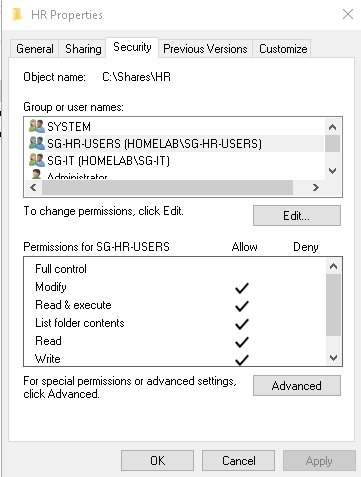
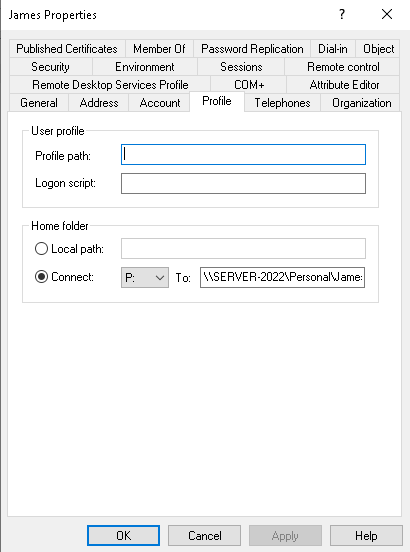
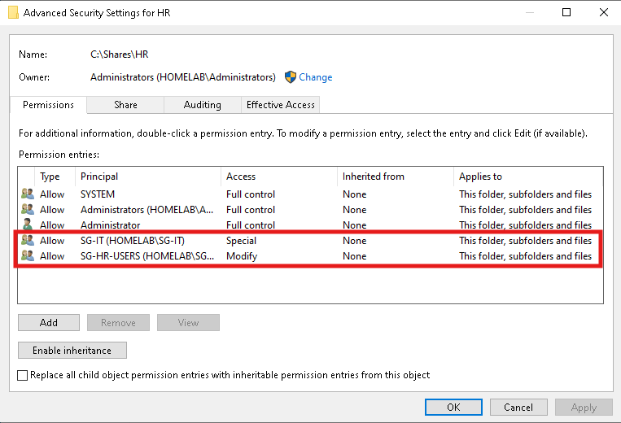

# 05 — File Shares

## What Was Built and Why

For this section, I created a couple of shared drives and set them up to reflect a distinction that comes up in all business environments. Resources that are required by the entire team versus those that are only to be accessed by a particular individual.

**HR share (mapped to Z:)**

Firstly, I set up a departmental drive that is to be accessible to the entire HR department. Since the access should follow a departmental membership, and not a specific person, permissions on this share were set up on `SG-HR-Users`. Thus, anyone added to the group now or in the future would be able to access its contents automatically, and anyone who is removed from the group would immediately lose access to the content as well. All while not touching the share itself.

**Personal share (mapped to P: via Home Folder)**
Following that, an individual home was created that is tied to a specific user, `James`, which was configured through the user's  **Home Folder** attribute in AD rather than a manually mapped drive. Thus, the user is able to access it on any machine they log onto, rather than depending on a login script or manual setup every time. As opposed to the HR Share, this one is deliberately meant for an individual account, as the prime point for a home folder is privacy. No other users within the HR OU would be able to access this folder.

---

## Access Tiers on the HR Share

| Principal | Permission | Reasoning |
|---|---|---|
| `SG-HR-Users` | Modify (Read/Write) | Department staff need to read and add their own content |
| `SG-IT` | Special — Read and Write only | Helpdesk can view and edit files to assist, but doesn't get Modify's broader rights (such as delete), since fixing an issue shouldn't require the ability to remove HR's content |
| Administrators | Full Control | Full administrative control, standard for the built-in group |

---

## Key Lessons Learned

- **Permissions moved from individual accounts to groups, and the transition wasn't automatic.** Adding a group's permission entry didn't remove the old individual entries. Both had to be explicitly cleaned up on both the NTFS (Security) and Share permission tabs, or the share would have two separate, overlapping paths granting the same access.
- **Not everything should be grouped.** The Personal share was deliberately kept on the individual account rather than moved to a group, since a home folder's entire purpose is that it belongs to one person. This was a case for choosing the individual-account approach on purpose, not a gap in the least-privilege pattern used elsewhere.
- **Share and NTFS permissions are two separate layers that both need attention.** Updating one without the other leaves whichever is more restrictive still in control, so both had to be checked when re-pointing to groups.
